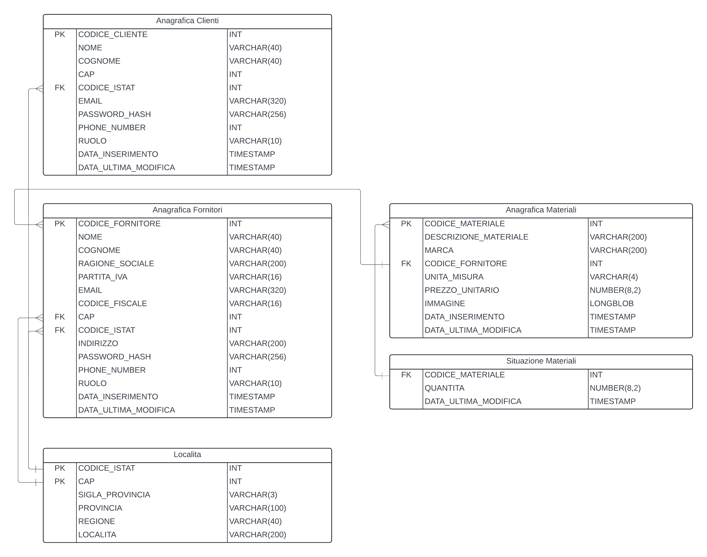

# MagicShelf

## Contenuti

- [Informazioni Generali](#informazioni-generali)
- [Features Utenti](#features-utenti)
- [Features Fornitori](#features-fornitori)
- [Struttura del Progetto](#struttura-del-progetto)
- [Installazione ed Esecuzione](#installazione-ed-esecuzione)
- [API EndPoints](#api-endpoints)
- [Database e Schema Er](#database-e-schema-er)
- [Documentazione](#documentazione)

## Informazioni Generali

Il progetto si propone di realizzare un’applicazione web moderna e innovativa, progettata per rispondere alle esigenze di un mercato sempre più dinamico e interconnesso. L'app ha l'obiettivo di creare un punto di incontro tra acquirenti e fornitori, offrendo loro strumenti avanzati per semplificare la ricerca e la gestione dei prodotti.

In un contesto in cui la disponibilità di prodotti è vasta e spesso dispersiva, la necessità di strumenti che consentano una ricerca mirata è sempre più pressante. La nostra piattaforma vuole colmare questa lacuna, permettendo agli utenti di individuare prodotti in base a criteri specifici come qualità, marca, zona geografica e fascia di prezzo. Allo stesso tempo, offre ai fornitori un ambiente digitale in cui possono inserire, aggiornare e promuovere i propri materiali, migliorando la visibilità delle loro attività.

## Features Utenti

- Loggati o registrati inserendo i dati personali, compresi quelli della località.
- Possibilità di visualizzare e modificare il proprio profilo nella apposita sezione.
- Naviga alla pagina di ricerca e applica i filtri da te desiderati.
- Visualizza i fornitori trovati con i filttri applicati.
- Possibilità di visualizzare i dettagli del singolo fornitore, compresi gli altri prodotti da lui pubblicati.

## Features Fornitori

- Loggati o registrati inserendo i dati personali, compresi quelli della località.
- Possibilità di visualizzare e modificare il proprio profilo nella apposita sezione.
- Inserimento, modifica e cancellazione di un nuovo prodotto.
- Inserimento, modifica e cancellazione della quantità di un nuovo prodotto.
- Visualizzazione dei propri materiali.

## Struttura del Progetto

### Backend

- Database ==> MySql
- XAMPP ==> Host per Database
- Node.js ==> Ambiente di esecuzione JavaScript lato server
- Express ==> Framework server-side
- Joi ==> Validazione del payload JSON
- Swagger ==> Documentazione Endpoint [link](http://localhost:3000/api-docs)
- Pacchetti: bcrypt, cookie-parser, jsonwebtoken, dotenv, multer

### Frontend

- Vue.js ==> Framework frontend per lo sviluppo di interfacce utente
- Vite ==> Build tool per lo sviluppo
- Vue Router ==> Libreria per la gestione delle rotte
- Axios ==> Libreria per le richieste HTTP
- TypeScript ==> Superset tipizzato di JavaScript
- Pinia ==> Libreria per state management
- Bootstrap e SASS ==> Framework e estensione di CSS per lo stile
- Figma ==> Strumento di design delle interfacce
- Pacchetti: oh-vue-icons

## Installazione ed Esecuzione

1. Clonare il repository utilizzando il comando

```sh
git clone https://github.com/maicolsanti/magicshelf.git
```

### BE

2. Spostarsi nella cartella backend

```sh
cd backend
```

3. Installare le dipendenze

```sh
npm install
```

4. Creare un file chiamato .env e al suo interno copiare le seguenti variabili d'ambiente

```text
DB_HOST='yourhost'
DB_USER='youruser'
DB_PASSWORD='yourpassword'
DB_NAME='magicshelf'
JWT_SECRET='yourjwtsecret'
```

5. Eseguire il backend

```sh
npm start
```

### FE

6. Spostarsi nella cartella frontend

```sh
cd..
cd magicShelf
```

7. Avviare il frontend

```sh
npm run dev
```

8. Visitare il link mostrato per visualizzare l'applicazione web

## API Endpoints

La documentazione dettagliata degli endpoint si trova all'interno dello swagger.
Per visualizzarlo arrivare al passaggio 5 di [Installazione ed Esecuzione](#installazione-ed-esecuzione) e navigare all'indirizzo <http://localhost:3000/api-docs/#/>

### Auth Clienti

- /auth/clienti/register
- /auth/clienti/login

### Auth Fornitori

- /auth/fornitori/register
- /auth/fornitori/login

### Auth General

- /auth/general/getProfile
- /auth/general/getProfile

### Clienti

- /auth/general/getProfile
- /clienti/getById/{codice_cliente}
- /clienti/create
- /clienti/update/{codice_cliente}
- /clienti/delete/{codice_cliente}

### Fornitori

- /fornitori/getAll
- /fornitori/getById/{codice_fornitore}
- /fornitori/create
- /fornitori/update/{codice_fornitore}
- /fornitori/delete/{codice_fornitore}

### Località

- /localita/getAll
- /localita/getById/{codice_istat}
- /localita/getByCap/{cap}
- /localita/getByCapDenominazione/{cap}/{denominazione}

### Materiali Fornitori

- /materiali-fornitori/getAll
- /materiali-fornitori/getById/{codice_fornitore}
- /materiali-fornitori/getFiltered

### Materiali

- /materiali/getAll
- /materiali/getById/{codice_materiale}
- /materiali/create
- /materiali/update/{codice_materiale}
- /materiali/remove/{codice_materiale}

### Situazione Materiali

- /situazione-materiali/getAll
- /situazione-materiali/getById/{codice_materiale}
- /situazione-materiali/create
- /situazione-materiali/create
- /situazione-materiali/remove/{codice_materiale}

## Database e Schema Er



## Documentazione

- SWAGGER <https://swagger.io/docs/>
- MYSQL <https://dev.mysql.com/doc/>
- EXPRESS <https://expressjs.com/it/>
- JOI <https://joi.dev/>
- VUE <https://vuejs.org/guide/introduction.html>
- PINIA <https://pinia.vuejs.org/>
- BOOTSTRAP <https://getbootstrap.com/docs/5.3/getting-started/introduction/>

## Nice to have / sviluppi futuri

- geolocalizzazione
- profilazione utente secondo le proprie ricerche
- ricerche salvate nei preferiti
- integrazione inserimento prodotti con gestionali dei fornitori
- ordine online
